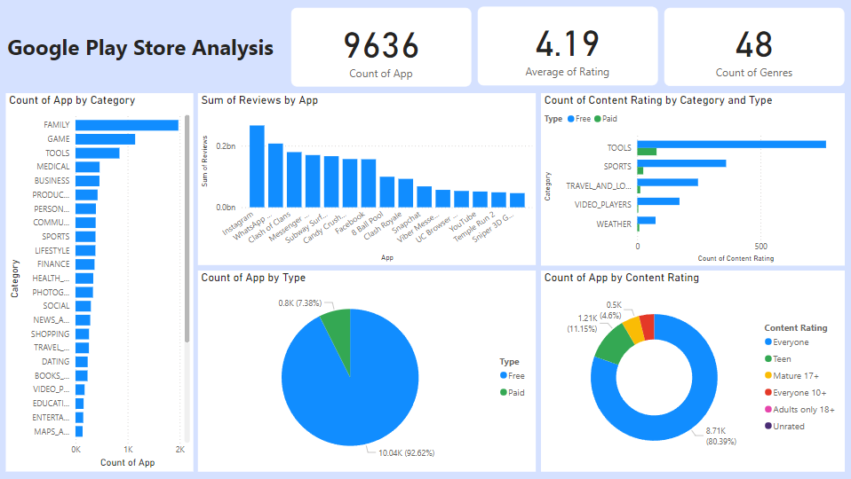

# SQL-Project
The aim of this project is to derive insights from applications hosted on the Google Play Store and present these insights through visualizations. These visualizations can be utilized to enhance user experience and optimize the application development process.

## Tools Used
- **Excel**
- **My SQL** 
- **Power BI**

## Steps
## 1. **Data Collection**: 
The dataset used in this project was collected from Kaggle and contains the following columns:

- **App**: Name of the application
- **Category**: Category of the application
- **Rating**: Average user rating of the application
- **Reviews**: Number of user reviews
- **Size**: Size of the application (in bytes)
- **Installs**: Number of installations
- **Type**: Type of the application (Free or Paid)
- **Price**: Price of the application (if any)
- **Content Rating**: Age group recommendation
- **Genres**: Genre of the application
- **Last Updated**: Date when the application was last updated
- **Current Ver**: Current version of the application
- **Android Ver**: Minimum required Android version

## 2. **Data Cleaning and Preparation (Excel)**:
Before analyzing the Playstore Apps dataset, it is essential to clean and prepare the data to ensure accuracy and reliability. This section outlines the steps taken to clean and prepare the data using excel.

### **2.1 Handling Missing Values:** 
- Missing values were identified.
- Numerical columns (`Rating`, `Reviews`, `Size`, `Price`) had missing values filled with the mean or median.
- Categorical columns (`Category`, `Type`, `Content Rating`, `Genres`, `Android Ver`) had missing values filled with the mode.

### **2.2 Data Validation and Correction:**
- **Date Columns**: `Last Updated` was converted to Date type.
- **Numerical Columns**: Validated `Rating`, `Reviews`, `Size`, `Installs`, `Price` as numerical values. Non-numeric characters were removed and sizes converted to megabytes.
- **Categorical Columns**: Validated `Category`, `Type`, `Content Rating`, `Genres`, `Android Ver` as text, correcting discrepancies based on a predefined list of acceptable values.

### **2.3 Removing Duplicate Values:** 
- Identified and removed duplicate rows based on the `App` name and other relevant columns to retain unique entries.

### **2.4 Data Validation:**
- Ensured numerical values were within expected ranges and categorical values were consistent.

## 3. **Insights using MySQL**:
A schema was created using the cleaned dataset for playstore apps and queries in MySQL Workbench was used to answer the following the problem statements

**Problem Statements-**

1. What is the total number of apps available?
2. Number of Categories present in the dataset
3. All categories with the number of apps in the dataset
4. Which are the top 10 highest rated apps in the given available dataset?
5. What is the average rating of all apps?
6. What is the total number of reviews for all apps?
7. Which app has the most reviews?
8. How many apps are there in each category?
9. Apps with More Than 1 Million Installs
10. What is the average size of the apps?
11. How many paid apps and how many free apps are there?
12. Which apps have a rating above 4.5?
13. What is the distribution of content ratings among the apps?
14. What are the different genres of apps and their counts?
15. What is the average rating per category?
16. What are the total sales from paid apps?
17. What are the top 5 genres by average rating?
18. Which apps have reviews containing the word 'excellent'?
19. What are the top 5 most expensive apps?
20. Which apps have a rating below 2.0?
21. Which are the top 5 most installed apps in the 'Games' category?
22. Which apps have no reviews?
23. What is the total number of free apps in each category?
24. What is the average rating of free apps compared to paid apps?

## **Data Visualization (Power BI)**

  

## **4.Analyzing and interpreting data:**
 1. There are total 33 categories and 9636 applications in the given dataset with an overall average rating of 4.2 and an average application size of 19.38 MB.
 2. The largest app on the Play Store is ‘Hungry Shark Evolution’ belonging to ‘Game’ category with 95.37 MB.
 3. For content rating, majority of the applications fall under ‘Everyone’ followed by ‘Teen’ and ‘Mature17+’.
 4. Majority of the apps, 92.06% are listed as free while only 7.94% being of paid type.
 5. ‘Family’ followed by ‘Game’ have the highest number of paid apps.
 6. ‘Family’ is the top category with the highest number of applications followed by ‘Game’ while ‘Beauty’ and ‘Comics’ being the lowest.
 7. ‘Events’ is the top category with the highest average rating of 4.45 followed by ‘Education’ and ‘Art and design’.

